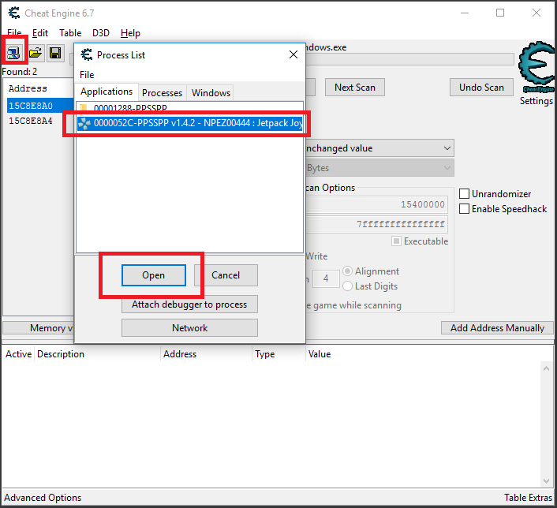
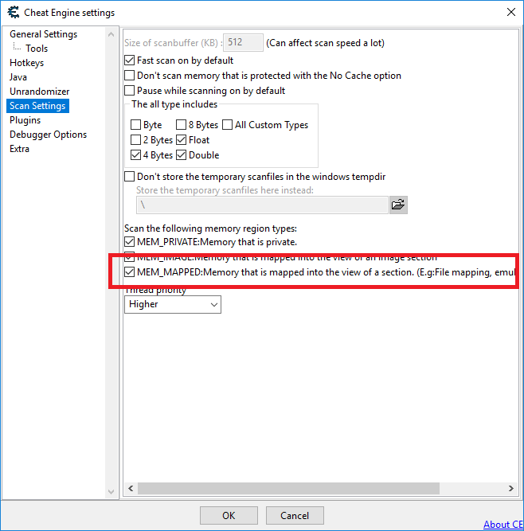
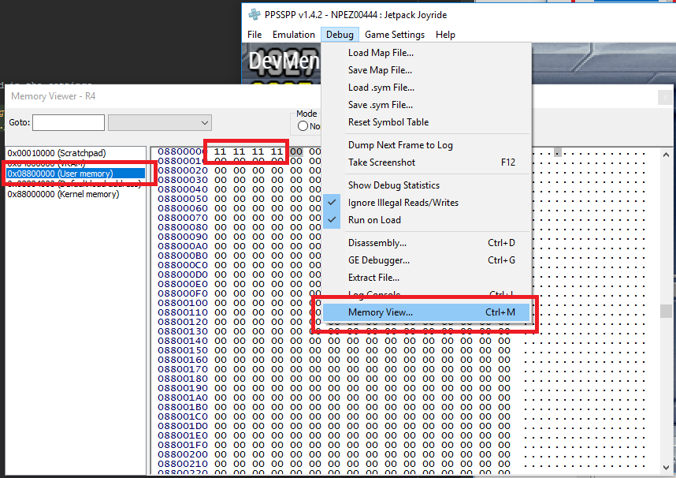
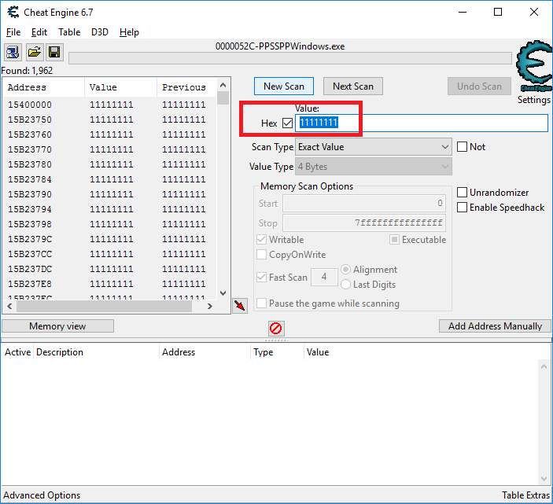
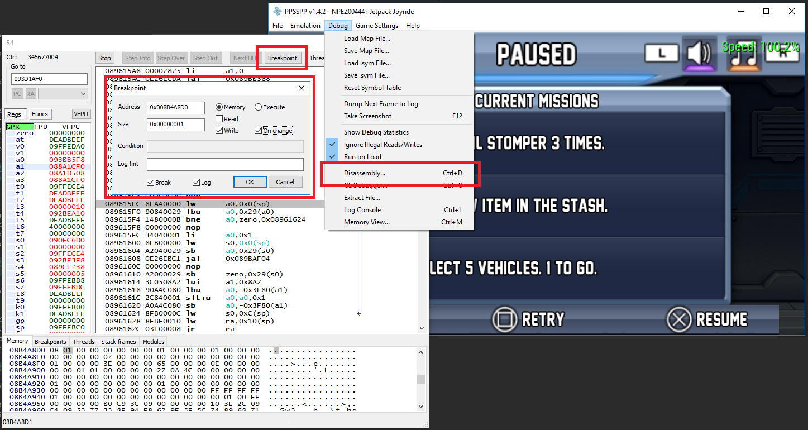
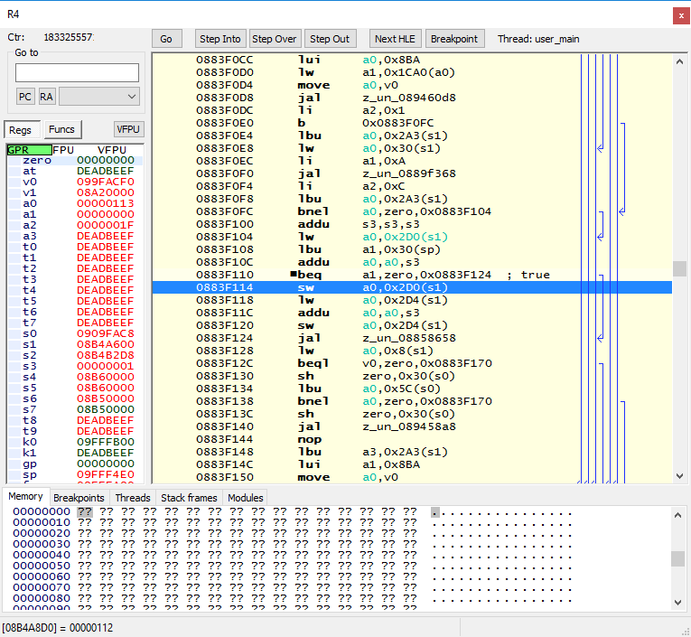
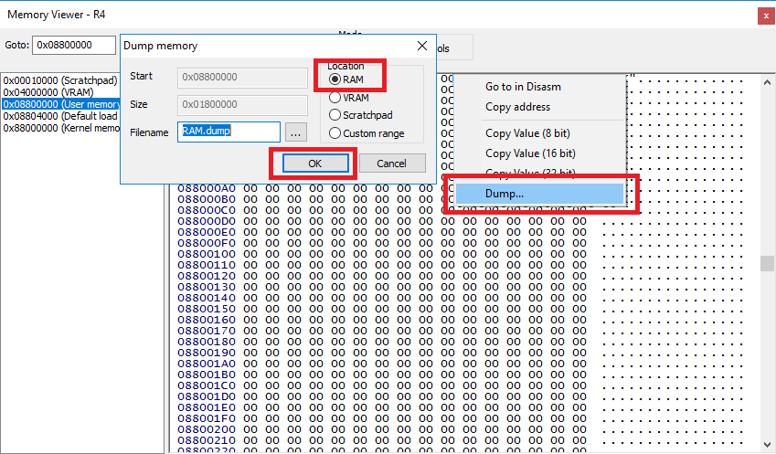
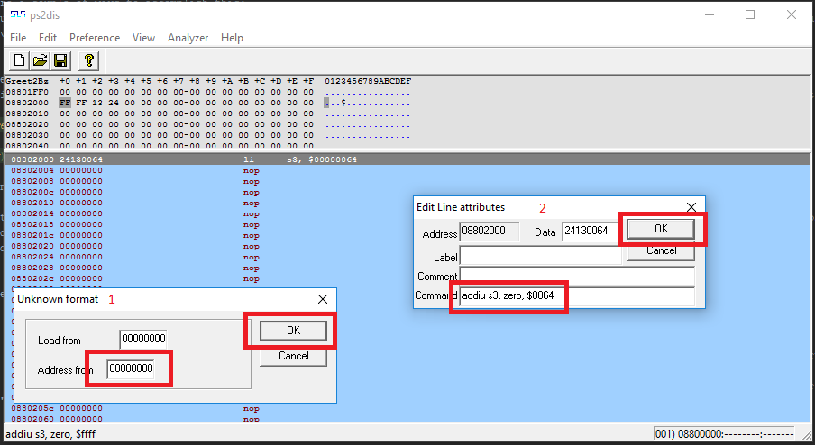
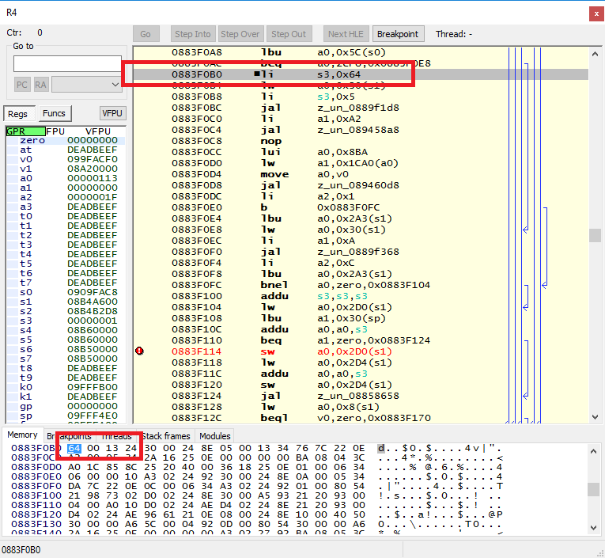

## Requirements

 * PPSSPP: https://www.ppsspp.org/downloads.html
 * Cheat Engine: http://www.cheatengine.org/downloads.php
 * ps2dis: http://www.codemasters-project.net/portal-english/apportal/download.php?view.23

## Limitations

PPSSPP is an emulator and does not perfectly emulate games.

This can lead to cases where memory may be mapped to a different address in the emulator vs. where it would be mapped to on a physical PSP. The address may also shift over time with new releases of the emulator.

This issue is limited to 

## Assumptions

This guide assumes the following knowledge:
 * An understanding of common cheat related terms.
 * How to use search tools to find the address of a value you want to modify.
 * An understanding of the basic MIPS instructions.

## Steps

### 1. Launch the game
1. Launch PPSSPP and open the game you want to make cheats for.

### 2. Attaching Cheat Engine to PPSSPP
1. Launch Cheat Engine.
2. Click the open process button.
3. Select the PPSSPP process from the list.
4. Click the "Open" button.
5. Ensure the "MEM_MAPPED" setting is enabled in the settings.





### 3. Determining the PSP user memory offset
1. Open the PPSSPP Memory Viewer (Debug > Memory Viewer).
2. Navigate to the start of user memory by double clicking on the "0x08800000 (User Memory)".
3. Set the first 4 bytes of the user memory to something you can easily search for in PPSSPP.
4. Search for the value in Cheat Engine.
5. Repeat the above 2 steps until you are able to filter the address down to a single result in Cheat Engine the address of this result is where the user memory starts.





In the above example the user memory starts at 0x01540000 in the process memory.

### 4. Use Cheat Engine to find the address of the variable you want to modify
1. Set the memory scan start address to the address where the user memory starts.
2. Use the search options in Cheat Engine to find a list of potential addresses. Try to reduce the search results to as small a number as possible.
3. Determine the address in user memory where the value is located by subtracting the offset where user memory starts in the PC process and then adding 0x08800000.
4. Filter down any remaining results by changing the value in PPSSPP using the memory viewer mentioned above and determining to see which address is the source of truth.


In the above example the search results have been filtered to 2 possible addresses. The user memory starts at offset 0x01540000 in the process memory. This gives the following 2 potential PSP memory addresses for the variable:

 * 0x08B4A8D0 (= 0x1574A8D0 - 0x15400000 + 0x08800000) ** this address is the source of truth in this case.
 * 0x0960237C (= 0x1620237C - 0x15400000 + 0x08800000)

### 5. Use the disassembly tool to determine what code changes the value.

Because the offsets of data addresses may not be consistent across emulator versions and physical hardware it makes our job a little harder.

Rather than using the cheat engine to set the value direct it the compatibility of the cheat can be increased by instead rewriting the logic of the game.

For example, when making an infinite health cheat there are a couple of ways to accomplish this:
 * Jump to a subroutine created by the cheat when the value is read from (in this case we would set a read breakpoint). Typically 0x08802000 is unused by games and is safe for writing custom logic to.
 * No-op the logic responsible for decreasing the health value (in this case we would set a write breakpoint).

1. Open the PPSSPP Disassembler (Debug > Disassembly...).
2. Click the "Breakpoint" button, enter the address of the value found in step 4 and configure the conditions under which the breakpoint should be triggered.
3. Play the game to trigger the condition for the breakpoint to be hit. The game will often read/write to an address in a number of different functions. To avoid the breakpoint being hit in unwanted cases it may be necessary to continue past these using the debugger (by clicking the "Go" button) or nop out/change the address these functions similar to what is described below.





The above screenshots show a write breakpoint being set and how the debugger looks when it is hit.

In the example above a write breakpoint has been set and the instruction at 0x0883F114 is responsible for writing to that address. From the logic around that area the following can be observed:
 * The value stored in the a0 register is writen to the address we set our breakpoint to.
 * The value in the a0 register is loaded from the same address it is written to and then incremented by the value in the s3 register being being stored.
 * In our case the value in the s3 register is set to 1 at 0x0883F0B0.

The following step will be looking at rewriting the logic which sets this value.

### 6. Re-writing the games logic

This is where things get quite tedious. The memory editor of PPSSPP is very restrictive and doesn't offer a method of converting a MIPS instruction to its hexadecimal representation. Fortunately ps2dis can be used to work around this limitation but adds additional steps to the process.

1. Create a memory dump of the user memory by opening the memory viewer once again. Right click on the hex view and click the "Dump..." menu item. In this case a memory dump of any other game will do, or even a file full of nothing. This file is just needed so that we have something to load into ps2dis.
2. Open ps2dis and load your memory dump. Enter "08800000" in the "Address From" text box when prompted.
3. Navigate to an empty space of the file. There is often a sufficient empty space around "0x08802000" which is perfect for injecting your subroutines.
4. Start writing the instructions you want to inject into the game. You can edit the value of an address by double clicking on it.





The above example shows that the instruction "addiu s3, zero, $0064" translates to a value of 0x24130064. This value will be injected into the game in the next step to influence the final value of the a0 register. Rather than incrementing by 1 each time the breakpoint is hit the register will instead be increased by 100 (0x64).

### 7. Injecting your new logic

Again, because the memory editing capabilities of PPSSPP are quite limited this step can also be quite tedious.

1. Navigate to the address you want to edit in either the disassembler or memory viewer. If in the disassembler you can quickly navigate to an address displayed in the disassembler by right clicking on it and selecting "Go to in Memory View".
2. Insert your updated logic into the appropriate addresses in the memory editor. Ensure you enter the bytes of each instruction in reverse order.



### 7. Test your changes

Almost done. Resume the game and test the changes work as expected. If the changes work as expected all that is needed is to convert them to CWCheat format so they can be used by everyone.

### 8. Convert the cheat to CWCheat format

This step is much simpler, in our case all of the instructions we change will follow the following format:

```
_S GAME-ID (eg. NPEZ-00044)
_G Game Name
_C0 Cheat Name
_L 0x2AAAAAAA 0xBBBBBBBB
_L 0x2AAAAAAA 0xBBBBBBBB
...
```

In the above example:
 * AAAAAAA should be substituted with the address(es) you wrote to (minus 0x08800000 as CWCheat uses 0x08800000 as a base address)
 * BBBBBBBB should be substituted with the hex value of the instruction.

Continuing from the example above, the cheat code would be as follows:

```
_S NPEZ-00044
_G Jetpack Joyride
_C0 Coin Multiplier
_L 0x2003F0B0 0x24130064
```
